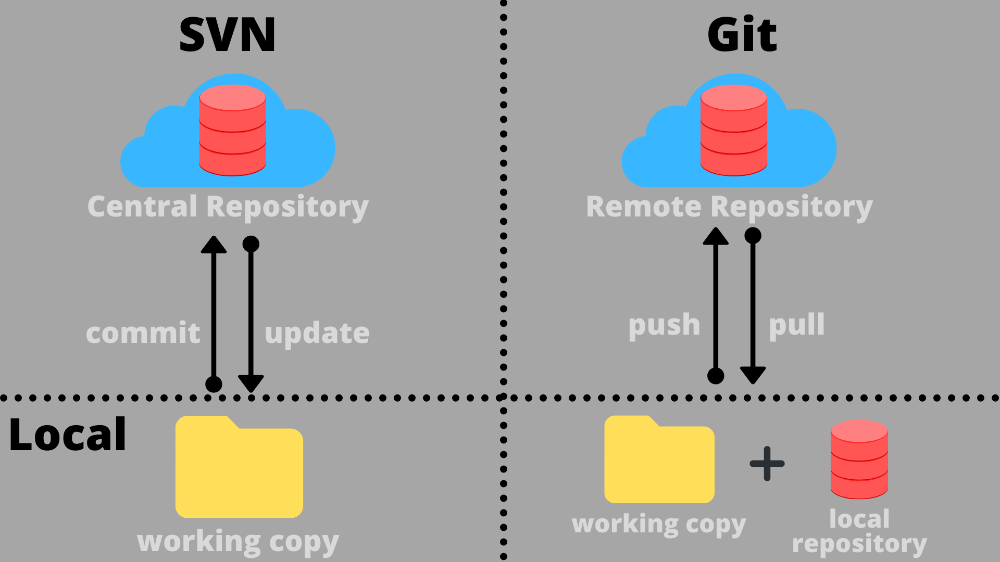

# Technical Report for Class Assignment 1 

## Introduction


This is a technical report for de Class Assignment 1 about **Version Contrl** (a crucial practice in managing software development projects), made by Maria Parreira n.º 1231843, ISEP and Switch student.

This report provides a detailed account of the steps taken to complete the assignment, including the commands used, the issues encountered, and the solutions implemented.

The report is divided into two sections:

1.Git Tutorial (divided in part 1 and 2)

2.Analysis of an Alternative Version Control Solution: Subversion

To support this assignment will be used an example application : Tutorial React.js and Spring Data REST.

(source code available at https://github.com/spring-guides/tut-react-and-spring-data-rest)


## Git Tutorial 
Description of the steps used to achieve the requirements using Git and its commands.


### _Part 1 (use only the main branch)_

### 1. Clone the tutorial React.js and Spring Data REST into a new folder

```bash
    git clone https://github.com/spring-guides/tut-react-and-spring-data-rest> tutorial
```

### 2.Create and initialize your individual repository

2.1. Log in into GitHub and create an empty repository (can include README.md file)
      
2.2. In your local computer create a folder named c:\devops (this new folder will contain a clone of your remote repository)
```bash
mkdir devops
```

2.3. Using the terminal in your local computer to create a clone of the repository.The command to use should be:
```bash
git clone https://github.com/mariaparreira-code/devops-23-24-JPE-1231843 devops
```

#### Another Alternative Way:
After creating a remote repository on GitHub, you can initialize a local repository, add a README file, and pushing the initial commit to the remote repository:
```bash
git init
echo "# repository-name" >> README.md
git add README.md
git commit -m "message"
git remote add origin git@github.com:mariaparreira-code/devops-23-24-JPE-1231843.git
git push -u origin main
```

### 3. Check the status of your files
```bash
git status
```

### 4. Create a _.gitignore_ file
The _.gitignore_ file should be created to avoid the inclusion of unnecessary files in the repository.
```bash
touch .gitignore
```
4.1. Set up the file with: https://www.gitignore.io 
(I used the Nano text editor, but Vi can also be used)

4.2. Begin tracking the new file:
```bash
git add .gitignore
```
4.3. Save changes that have been added to the staging area:
```bash
git commit -m "add .gitignore" 
(commit messages help others understand why a commit was made)
```

4.4. Push it to remote
```bash
git push origin main
```

### 5. Create CA1 folder in your local repository and copy the basic folder from tutorial to there

5.1. Go to the devops-23-24-JPE-1231843 folder:
```bash
mkdir CA1
```
5.2. Go to the tutorial folder and use command:
```bash
 cp -r tut-react-and-spring-data-rest/basic CA1 (copy the basic directory that is inside the tut-react-and-spring-data-rest directory to the CA1 destination directory. -r indicates that the copy will be recursive)
```
```bash
cp tut-react-and-spring-data-rest/pom.xml CA1 (copy the pom.xml file)
```

###  6. Check the status and track new files 
```bash
git status
```
```bash
git add
```

### 7. Commit and push to remote
```bash
git commit -m "message close #(issue number)"
```
```bash
git push origin main
```
```bash
git status
```

### 8. Mark the first version of the application

"Tags" are frequently used to give human-readable names to important milestones so that they can be easily accessed later (for example, "version-1.2").

8.1. Create a tag, through the command:
```bash
git tag -a v1.1.0 -m "version 1.1.0 released"
```
8.2. Push it through the command:
```bash
git push origin --tags
```


### 9. Let develop a new feature to add a new field to the application

9.1. Open intellij and go to the Employee class

9.2. Add private attribute (integer) jobYears and add it to constructor method

9.3. Add method to validate constructor arguments: private boolean areConstrutorArgumentsValid(String firstName, String lastName, String description, int jobYears)

9.4. Add methods getJobYears() and setJobYears(int jobYears)

9.5. Create the test folder inside the src folder: mkdir test

9.6. Create the java folder inside the test folder: mkdir java

9.7. Create the com.gregIturnquist.payroll folder inside the java folder: mkdir com.gregIturnquist.payroll
      
9.8. Create a java test class: EmployeeTest (to test Employee Class)


### 10.When the new feature is completed (and tested) commit and push the code

10.1. Repeat steps 6 and 7 for new changes introduced


### 11.Mark the second version of the application

11.1. Create a tag, through the command: git tag -a v1.2.0 -m "version 1.2.0 released"

11.2. Push it through the command: push origin --tags


12.At the end of the assignment mark your repository with the tag ca1-part1

12.1. Create a tag, through the command: git tag -a ca1-part1 -m "ca1-part1 released"
```bash
git tag -a ca1-part1 -m "ca1-part1 released"
```
12.2. Push it through the command:
```bash
git push origin --tags
```


### _Part 2 (create and use new branches)_


### 1.Create a branch named email-field

```bash
git branch email-field
``` 


### 2.Verify the branches that currently exist in this repository
2.1. Use the command:
```bash
git branch 
```
2.2. Switch to the email-field branch, using the command:
```bash
git checkout email-field
```

### 3.In the branch email-field let develop a new feature to add a new field to the application

3.1. Open intellij and go to the Employee class

3.2. Add private attribute (String) email and add it to constructor method

3.3. Add methods getEmail() and setEmail(String email)

3.4. Go to the EmployeeTest class and add unit tests for testing the creation of Employees and the validation of their attributes (for instance, no null/empty values).


### 4. Commit and push the new feature to the email-field branch
```bash
git add
git status
git commit -m "message close #(issue number)"
git push origin email-field
```

### 5. Merge changes with the main branch
```bash
git checkout main
git status
git merge email-field
git push 
```

### 6. Mark the third version of the application

6.1. Create a tag, through the command:
```bash
git tag -a v1.2.0 -m "version 1.2.0 released"
```
6.2. Push it through the command:
```bash
push origin --tags
```


### 7. Create a branch for fixing bugs

```bash
git branch fix-invalid-email
```

### 8. Switch to the fix-invalid-email branch

```bash
git checkout fix-invalid-email
```

### 9. The server should only accept Employees with a valid email

9.1. Open intellij and go to the Employee class

9.2. Add method to validate email argument: private boolean isValidEmail(String email)

9.3. Go to the EmployeeTest class and add unit tests for testing the creation of Employees with invalid email.


### 10. Commit and push the new feature to the fix-invalid-email branch

10.1. Repeat step 3 for new changes introduced

### 11. Merge changes with the main branch

11.1. Repeat step 4 for new changes introduced, but now with fix-invalid-email branch


### 12. Mark the third version of the application (with a change in the minor number, v1.3.0 -> v1.3.1)

12.1. Create a tag, through the command:
```bash
git tag -a v1.3.1 -m "version 1.3.1 released"
```

12.2. Push it through the command: 
```bash
push origin --tags
```


### 13.At the end of the assignment mark your repository with the tag ca1-part2

13.1. Create a tag, through the command: 
```bash
git tag -a ca1-part2 -m "ca1-part2 released"
```

13.2. Push it through the command:
```bash
push origin --tags
```

## Analysis of an Alternative Version Control Solution: Subversion

This following section provides an analysis of Subversion (SVN) as an alternative version control solution to Git, focusing on its features, differences from Git, and its application to the assignment goals.
It was not implemented in the assignment.

Like Git, SVN allows several people to work simultaneously on the same project, controlling versions and changes efficiently.

However, unlike git, SVN is a centralized version control system, which means that there can only be a single main repository on the server and the developers can only interact with that copy. 
All the changes will be directly pushed and merged into this main repository. We need an internet connection to work with SVN.
The basic difference between the workflow of Git and SVN is summarised by the following illustration.



from: https://www.studytonight.com/git-guide/git-vs-svn

### _Applying Mercurial to the Assignment Goals_

To achieve the same goals as presented in this assignment using Subversion, follow a workflow with some differences in commands and concepts:

1. **Repository Initialization**:

   1.1.Create an empty folder with the name svn, which is used as root for all your repository

   1.2.Create another folder my_repository inside svn

   1.3.Open the terminal and type
```
svnadmin create /home/user/svn/my_repository
```
2. **Clone remote repository**:
```
svn checkout https://example.com/svn/project local_project
```
3. **Add new files**:
```
svn add foo.cs
```
4. **Check the status of files and directories in the working copy**: 
```
svn status
```
5. **Commit your local changes to the repository**:
```
svn commit -m "My Descriptive Log Message"
```
6. **Tag Versions**:
```
svn copy -r 1234 ^/MyProject/trunk ^/MyProject/tags/version-1.2
```
In this specific case, the -r argument was used to indicate that the tag should be created from revision 1234 of the trunk.

7. **Branch for Features and Fixes**:
Creat a new branch requires you to run the command against the remote repository's URLs: 
```
svn copy https://svn.example.com/svn/MyRepo/MyProject/trunk https://svn.example.com/svn/MyRepo/MyProject/branches/MyNewBranch -m "Creating a new branch"
```
Check out a new working copy with the new branch or switch your existing working copy using:
```
svn switch
```
Subversion doesn't make any distinction between a tag and a branch. The only difference is in how you decide to use them. 
Traditionally, no commits are made to a tag once it has been created (to ensure that it remains an accurate "snapshot" of a past repository state). 
Subversion doesn't enforce any special tag-related rules by default since different people can use tags differently. 