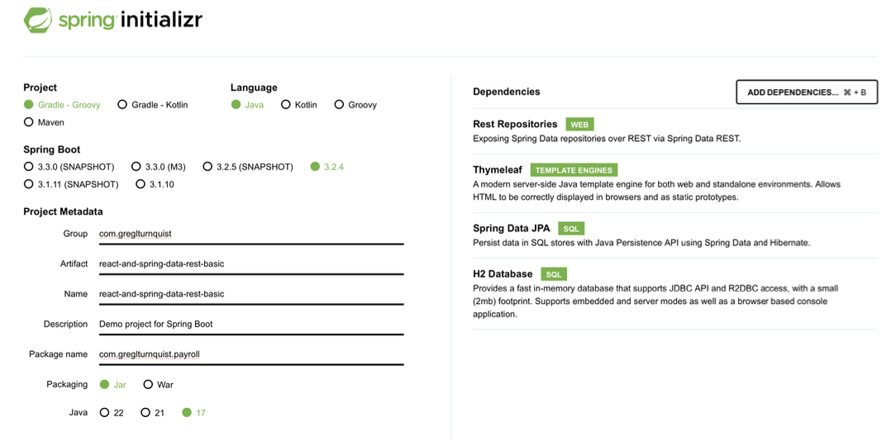
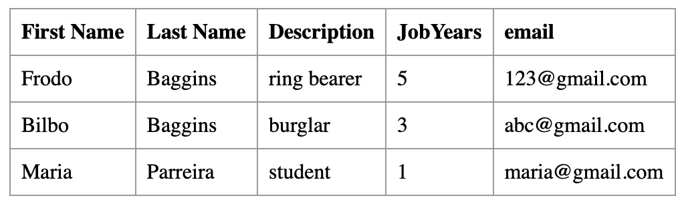

# Technical Report for Class Assignment 2 - Part 2


## Introduction

This is a technical report for de Class Assignment 2 about **Gradle** and **Maven**, made by Maria Parreira n.º 1231843, ISEP and Switch student.

This report provides a detailed account of the steps taken to complete the assignment, including the commands used, the issues encountered, and the solutions implemented.

To support this assignment will be used an example application : Tutorial React.js and Spring Data REST.

(source code available at https://github.com/spring-guides/tut-react-and-spring-data-rest)

The objective of Part 2 is to enhance the Tutorial application (described above) by transitioning its basic version, located in the 'basic' folder at CA1, to a better version, by implementing a basic Gradle and Maven setup.
The aim is to introduce new features and streamline the development process.

### The report is divided into three sections:

1. Gradle Tutorial

2. Alternative implementation solution: Maven

3. Comparison: Maven vs. Gradle


## Gradle Tutorial

Description of the steps used to achieve the **Class Assignment 2-Part 2** requirements using Gradle build tool and **Groovy** (a programming language that runs on the Java Virtual Machine used for scripting and building applications on the Java platform).

1. The first step is to create a new branch called "tut-basic-gradle" in the repository to work on. To do so, open terminal and type in the command:

```bash
  git branch tut-basic-gradle
```

After creating the branch, switch to it by typing:

```bash
  git checkout tut-basic-gradle
```

2. Go to [this website](https://start.spring.io) to generate a new gradle spring boot project.

Fill in the necessary information and add the needed dependencies according to the image below:


Click on the "Generate" button and download the project. Extract the files to the CA2.Part2/demoWithGradle folder.

Open the project in IntelliJ and delete de **src** folder.

3. Copy the **src** folder from CA1 to CA2.Part2 folder.


4. Copy the **webpack.config.js** and the **package.json** files from CA1 to CA2.Part2/demoWithGradle folder.


5. In the CA2.Part2/demoWithGradle folder, delete the **src/main/resources/static/built/** folder.


6. In the **Employee.java** class, change all *javax.persistence* imports to *jakarta.persistence*.


7. You can now experiment with the application by using (first navigate to the project folder):

```bash
  ./gradlew bootRun
```
Gradle will compile the project (if necessary) and then execute the Spring Boot application as if it were a regular Java application.


8. Add new files to the staging area:

```bash
  git add 
```

9. Commit the changes:

```bash
  git commit -m "feat: create a new branch and add a new gradle spring boot project #issueNumber"
```

10. Push the changes to the repository:

```bash
  git push
```

11. Open the build.gradle file and add the plugin org.siouan.frontend to the project:
```gradle
   id "org.siouan.frontend-jdk17" version "8.0.0"
```

By adding this plugin to build.gradle file, you can automate tasks related to the frontend, such as installing and configuring Node.js dependencies, as well as executing JavaScript scripts during the build process.

12. Configure the plugin added in the same build.gradle file:
```gradle
   frontend {
   nodeVersion = "16.20.2"
   assembleScript = "run build"
   cleanScript = "run clean"
   checkScript = "run check"
   }
```

These configurations enable customization and automation of various aspects of front-end development, such as building, cleaning, and checking, within the context of the org.siouan.frontend-jdk17 plugin.

13. Add the dependencies in the package.json file:
```gradle
   "scripts": {
   "webpack": "webpack",
   "build": "npm run webpack",
   "check": "echo Checking frontend",
   "clean": "echo Cleaning frontend",
   "lint": "echo Linting frontend",
   "test": "echo Testing frontend"
   }
```

These scripts are used to automate various development tasks, such as building, checking, cleaning, linting code quality, and running tests.

14. Add the package manager to the package.json file, before the scripts section:

```gradle
   "packageManager": "npm@9.6.7",
```

The npm is the default package for the Node.js environment, used for installing, managing, and sharing JavaScript code packages.
Defining the package manager in the package.json is useful to ensure that development team use the same npm version and have a consistent development environment configuration.

15. Compile the project in the terminal(first navigate to the project folder):

```bash
  ./gradlew build
```

The tasks related to the frontend are also executed and the frontend code is generated.


16. Open the build.gradle file and add the task:

```gradle
   task copyJarToDist(type: Copy, dependsOn: build) {
       from 'build/libs/'
       into 'dist'
       include '*.jar'
   }
```

17. Open the build.gradle file and add the task:

```gradle
   task deleteFilesWebpack(type: Delete) {
       delete 'src/main/resources/static/built'
   }
```

18. Add the following command to make sure this task is executed automatically by the task *clean*:

```gradle
   clean.dependsOn(deleteWebpackFiles)
```

19. Compile the project in the terminal(first navigate to the project folder):

```bash
  ./gradlew build
```

20. You may now execute the application by using (first navigate to the project folder):

```gradle
   ./gradlew bootRun
```

21. Open the web page http://localhost:8080 and you should view de next image:




22. Add all te files to the staging area:
```bash
  git add .
```

23. Commit the changes:

```bash
  git commit -m "feat: add copyJarToDist and deleteFilesWebpack task #issueNumber"
```

24. Push the changes to the repository:

```bash
  git push
```

### Now we need to merge to the master branch. To do so, follow these steps:

1. Switch to the master branch:

```bash
  git checkout master
```

2. Merge the tut-basic-gradle branch:

```bash
  git merge --no-ff tut-basic-gradle -m "merge tut-basic-gradle with main"
```

3. Push the changes to the repository:
```bash
  git push
```

## Alternative implementation solution: Maven

Here’s a detailed step-by-step guide on how Maven can replicate the tasks implemented in Gradle for the Spring Boot application, focusing on the same key areas: project initialization, frontend integration, packaging, and cleanup.

1. Project Initialization with Maven:

Similar to the Gradle approach (review point 2 about GradleTutorial), but selected **Maven** as the build tool.
The project was initialized with the same dependencies.
The generated **pom.xml** file serves as Maven’s build configuration file, analogous to Gradle’s **build.gradle**.

Copy the **src** folder, the **webpack.config.js** and the **package.json** files from CA1 to CA2.Part2/demoWithMaven folder.

2. Open the **pom.xml** file and add the plugin to integrate and manage frontend tasks:

Utilize the **Frontend Maven Plugin**. It manages frontend resources.
Specifically, it facilitates the integration of **Node.js** and **npm (Node Package Manager)** into the build process.
It also executes **webpack** as part of the Maven build process
In this case, it sets the directory where Node.js and npm will be installed (target directory).

```xml
    <plugin>
          <groupId>com.github.eirslett</groupId>
          <artifactId>frontend-maven-plugin</artifactId>
          <version>1.9.1</version>
          <configuration>
              <installDirectory>target</installDirectory>
          </configuration>
          <executions>
              <execution>
                  <id>install node and npm</id>
                  <goals>
                      <goal>install-node-and-npm</goal>
                  </goals>
                  <configuration>
                      <nodeVersion>v16.20.2</nodeVersion>
                      <npmVersion>6.13.4</npmVersion>
                  </configuration>
              </execution>
              <execution>
                  <id>npm install</id>
                  <goals>
                      <goal>npm</goal>
                  </goals>
                  <configuration>
                      <arguments>install</arguments>
                  </configuration>
              </execution>
              <execution>
                  <id>webpack build</id>
                  <goals>
                      <goal>webpack</goal>
                  </goals>
              </execution>
          </executions>
      </plugin>
```

3. Add **pom.xml** dependencies to configure the previous plug-in:

```xml
<dependencies>
         <dependency>
            <groupId>org.springframework.boot</groupId>
            <artifactId>spring-boot-starter-thymeleaf</artifactId>
         </dependency>
         
         <dependency>
            <groupId>org.springframework.boot</groupId>
            <artifactId>spring-boot-starter-data-jpa</artifactId>
         </dependency>
         
         <dependency>
            <groupId>org.springframework.boot</groupId>
            <artifactId>spring-boot-starter-data-rest</artifactId>
         </dependency>
         
         <dependency>
            <groupId>org.springframework.boot</groupId>
            <artifactId>spring-boot-devtools</artifactId>
         </dependency>

         <dependency>
            <groupId>org.springframework.boot</groupId>
            <artifactId>spring-boot-starter-test</artifactId>
            <scope>test</scope>
         </dependency>
</dependencies>
```

4. Copy the generated .jar file to a folder named ”dist” located the project root folder level:

Utilize the **Maven Jar Plugin**. It assists in the creation of JAR (Java Archive).
The specified configuration sets the output directory for the generated JAR file to ${basedir}/dist.
Essentially, it ensures that the JAR file created during the Maven build process is placed in the specified directory within the project's structure.

```xml
        <plugin>
            <groupId>org.apache.maven.plugins</groupId>
            <artifactId>maven-jar-plugin</artifactId>
            <version>3.4.0</version>
            <configuration>
                <outputDirectory>${basedir}/dist</outputDirectory>
            </configuration>
        </plugin>
```

5. Delete all the files generated by webpack (usually located at src/resources/main/static/built/):

Utilize the **Maven Antrun Plugin**.
This plugin configuration ensures that during the compile phase of the Maven build, the specified Ant task is executed.
This type of configuration is commonly used to perform custom build tasks or cleanup operations as part of the Maven build process.

```xml
        <plugin>
            <artifactId>maven-antrun-plugin</artifactId>
            <version>3.1.0</version>
            <executions>
                <execution>
                    <phase> compile </phase>
                    <configuration>
                        <target>
                           <delete dir="src/main/resources/static/built/" />
                           <delete dir="src/main/resources/static/static.built/" />
                        </target>
                    </configuration>
                    <goals>
                        <goal>run</goal>
                    </goals>
                </execution>
            </executions>
        </plugin>
```

6. Add **pom.xml** dependencies to configure the previous plug-in:

```xml
      <dependency>
         <groupId>org.apache.maven.plugins</groupId>
         <artifactId>maven-antrun-plugin</artifactId>
         <version>3.1.0</version>
      </dependency>
```


7. Compile the project in the terminal(first navigate to the project folder):

```bash
  mvn clean install
```
8. You may now execute the application by using (first navigate to the project folder):

```bash
  ./mvnw spring-boot:run
```
9. Open the web page http://localhost:8080 and you should view de next image:


10. Add all te files to the staging area:
```bash
  git add .
```

11. Commit the changes:

```bash
  git commit -m "feat: implement alternative solution with maven #issueNumber"
```

12. Push the changes to the repository:

```bash
  git push
```


### Comparison: Maven vs. Gradle

When it comes to choosing the right build automation tool for your Spring Boot application, understanding the differences and similarities between Maven and Gradle is essential.

#### Maven

Maven, a widely-used build automation tool, follows a convention-over-configuration approach.
It utilizes XML-based project configuration files (pom.xml) to define project structure, dependencies, and build settings.
Maven relies on a predefined lifecycle consisting of phases such as compile, test, package, and install, making it easy to understand and use.
However, Maven's XML configuration can become verbose, especially for complex projects, and its dependency management sometimes leads to conflicts or version mismatches.

#### Gradle

In contrast, Gradle offers a more flexible and concise build configuration using Groovy.
It provides a powerful scripting language that allows for fine-grained control over the build process.
Gradle's dependency management is more sophisticated, supporting transitive dependencies, dynamic versions, and conflict resolution.
It also allows for incremental builds, improving build performance for large projects.
However, the learning curve for Gradle can be steeper compared to Maven due to its scripting nature.

### Conclusion

Both Maven and Gradle have their strengths and weaknesses, making them suitable for different project requirements and team preferences.
Maven's simplicity and convention-driven approach make it a solid choice for smaller projects or teams familiar with XML configuration.
On the other hand, Gradle's flexibility and powerful scripting capabilities make it well-suited for larger, complex projects with specific customization needs.
Ultimately, the choice between Maven and Gradle depends on factors such as project complexity, team expertise, and desired level of control over the build process.


