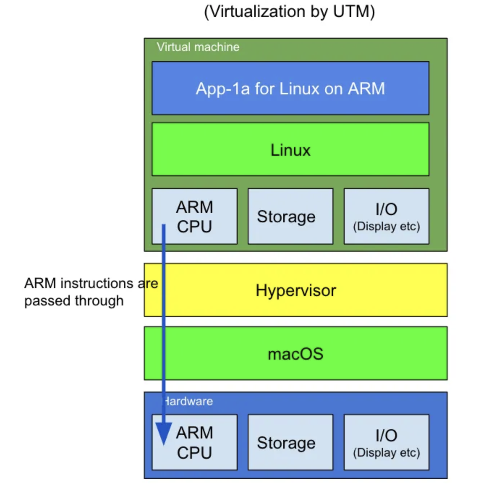
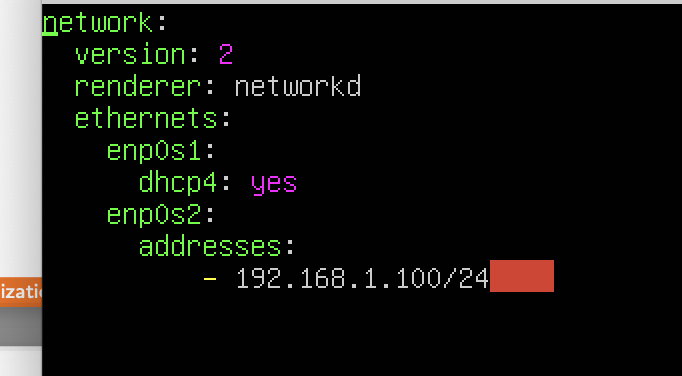
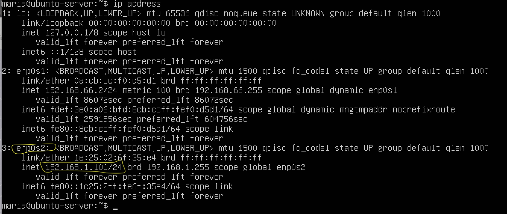

# Technical Report for Class Assignment 3 - Part 1

## Introduction

- This technical report documents Class Assignment 3 part 1 about **Virtualization**, completed by Maria Parreira (Student ID: 1231843), a student at ISEP and Switch.

- The aim of this assignment is to utilize virtualization techniques to migrate and operate previous projects within a virtualized Ubuntu environment, ensuring consistency and isolation from host systems. 
- This report documents the setup of the virtual machine (VM), configuration of development tools, and execution of specific projects-**Spring Boot tutorial and a Gradle demonstration**—providing detailed steps for others to replicate and understand the practical implications of virtualization in software development workflows.

### **Virtualization**

- In simple terms, **virtualization** is a technology used to create virtual representations of servers, storage, networks, and other physical machines. 
- Virtualization software replicates the functionalities of physical hardware, allowing multiple virtual machines to operate concurrently on a single physical machine.
- It is facilitated by a **hypervisor**, which serves as software enabling the operation of multiple virtual machines on a single physical machine. 
- Each virtual machine possesses its own operating system and applications, with the hypervisor managing the allocation of underlying physical computing resources such as CPU and memory to individual virtual machines as needed.

Broadly, there are two forms of virtualization:

1. **Hardware-level virtualization**: The hypervisor operates directly on the host hardware.
2. **Hosted virtualization**: The hypervisor runs atop the host OS.

This Class Assignment focuses on **Hardware-level virtualization** (as shown in the figure below):



- While numerous hypervisors exist, this assignment utilized **UTM**. UTM leverages Apple's Hypervisor virtualization framework to execute ARM64 operating systems on Apple Silicon.


## This Class Assignment is divided into three parts:

#### 1. Creating a VM with UTM and Ubuntu

#### 2. Networking Setup

#### 3. Clone, build and execute projects from previous assignments inside VM


## 1. _Create a VM with UTM and Ubuntu_

**To successfully install UTM and Ubuntu on macOS, the following steps should be followed:**

### 1. Download Ubuntu Server

- Navigate to [Ubuntu Server download page](https://ubuntu.com/download/server/arm) to acquire the 22.04.3 Ubuntu Server.


### 2. Install and Configure UTM

- Install UTM from [mac.getutm.app](https://mac.getutm.app) (complete the setup process according to provided instructions).

- In the first screen you will be given a choice of whether to use virtualization or emulation. Virtualization is always the best option, as the performance is vastly improved over emulation. 
- It is only necessary to use emulation when the guest OS or guest OS programs that are trying to emulate are not compatible with computer’s architecture.
- As Ubuntu is available for ARM architecture, it is possible to virtualize it on Apple Silicon.

### 3. Adding a New VM in UTM

- Open UTM and locate the option to add a new VM. Click the ‘+’ button on the main window.
    
- Choose the virtualization option and select Linux as the operating system.
    
- Browse and select the Ubuntu .iso file for booting.
    
- Proceed to configure settings such as virtual hard disk size, shared folders, and VM name.
    
- Save the settings.

- Highlight the Ubuntu virtual machine and click the Start button.

- The VM will boot from the installation disk, initiating the Ubuntu installation process.

- Follow on-screen instructions to select system language, keyboard layout, and network interface configuration.

- Choose "Use an entire disk" option for storage configuration to erase the virtual disk.
    
- Provide appropriate names and password during profile setup.
    
- Opt to skip options for upgrading to Ubuntu Pro, installing OpenSSH server, and Featured Server Snaps.
    
- Wait for the installation process to complete.

- Press the "Reboot Now" button upon completion of the installation process.
    
- Log in with the provided username and password.
    
- Once logged in, you can access the Linux terminal to execute commands and further configure the system.


## 2. _Network Setup_

**To successfully setup the vm's network, the following steps should be followed:**

### 1. Create a Host-Only Network

The goal of configuring a host-only network on a VM is to create an isolated environment where virtual machines can communicate with the host, but cannot access external networks such as the Internet.

This is particularly useful in development and testing scenarios, where you want to create a controlled environment.

- Open UTM.

- Navigate to the **Host Network Devices**.

- Click to add a new **host-only** network.

- Check the IP range for the host-only network (e.g., `192.168.66.2/24`).

- Assign an appropriate IP from this range to the adapter, such as `192.168.1.100/24`.

- Start your VM and log in.

- Update package repositories:
  ```bash
  sudo apt update
  ```
- Install necessary network tools:
  ```bash
  sudo apt install net-tools
  ```
- Configure the network interface by editing the Netplan configuration file:
  ```bash
  sudo nano /etc/netplan/01-netcfg.yaml
  ```
- This is how the `01-netcfg.yaml`should look like:



- Apply the changes with:
  ```bash
  sudo netplan apply
  ```
- Confirm network address with:
  ```bash
  ip address
  ```
  


## 3. _Clone, build and execute projects from previous assignments inside VM_

**After installing the Ubuntu on the UTM, the following steps should be taken to complete the assignment:**

### 1. Install git
```bash
sudo apt update
sudo apt install git
git --version
```

### 2. Install maven
```bash
sudo apt install maven
mvn --version
```

### 3. Install java
```bash
sudo apt install openjdk-17-jdk openjdk-17-jre
java -version
```

### 4. Install gradle
```bash
wget https://services.gradle.org/distributions/gradle-8.6-bin.zip
sudo mkdir /opt/gradle
sudo unzip -d /opt/gradle gradle-8.6-bin.zip
echo "export GRADLE_HOME=/opt/gradle/gradle-8.6" >> ~/.bashrc
echo "export PATH=$PATH:$GRADLE_HOME/bin" >> ~/.bashrc
source ~/.bashrc
gradle --version
```

### 5. Clone the remote repository

```bash
mkdir devops
cd devops

git clone https://github.com/mariaparreira-code/devops-23-24-JPE-1231843.git
```
(repository must be public)

### 6. Configure maven wrapper and gradle wrapper

- Maven wrapper and Gradle wrapper must be given permission to execute.
- To accomplish that, go to the respective projects folders (CA1 and CA2.Part1) and execute the following command depending on the project build tool used :

```bash
chmod +x mvnw
chmod +x gradlew
```

### 7. Run the project at CA1 folder with maven tool

```mvn
./mvnw spring-boot:run
```
- Get VM IP address with the command:

```bash
ip address
```

- While the project is running, you can open project on browser with url: http://(IP address):8080

### 8. Build the project at CA2.Part1 folder with gradle build tool

```bash
./gradlew build
```

- To run the server write command:
```gradle
./gradlew runServer
```

- To run the client open in host computer terminal at the same project folder, and do:
```gradle
./gradlew runClient --args= "(VM IP address) 59001" 
```

#### 9. Run the project at CA2 part 2 folder with gradle build tool

```gradle
./gradlew build
./gradlew bootRun
```
- Open project on browser with url: http://(VM IP address):8080


#### 10. Commit and push Changes to remote Repository

- Make frequent commits to repository with descriptive messages that clearly explain the changes or enhancements made.
  
```bash
  git add .
  git commit -m "Describe changes here"
  git push
```

#### 11. Tag for Release

- Once the assigment is complete tag repository to mark the version of the project

  ```bash
  git tag -a ca3-part1 -m "ca3-part1 release"
  git push origin --tags
  ```


## Conclusion

- This technical report demonstrates the setup and utilization of virtualization techniques to migrate and operate previous projects within a virtualized Ubuntu environment using UTM. 
- By following the outlined steps, a VM was created, networking for isolated development was configured, and essential development tools such as Git, Maven, Java, and Gradle were installed.
- Practical applications were illustrated by cloning, building, and executing projects from previous assignments, showcasing how virtualization can streamline software development workflows.


