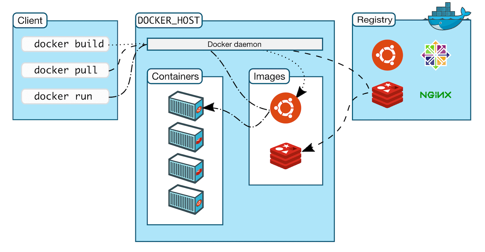

# Technical Report for Class Assignment 4 Part 1

- This technical report documents Class Assignment 4 part 1 about **Docker**, completed by Maria Parreira (Student ID: 1231843), a student at ISEP and Switch.


## Introduction

- Docker is a containerization platform that allows to package an application and its dependencies into a standardized unit called a container. 
- Containers are lightweight, portable, and isolated environments that ensure consistency in development, testing, and deployment processes.

- Docker simplifies the process of building, shipping, and running applications by providing a consistent environment across different systems, regardless of the underlying infrastructure. It achieves this through containerization, which encapsulates the application, its dependencies, and runtime environment into a single package. This package, known as a Docker image, can be easily shared and deployed across various environments, from development laptops to production servers.

- **Advantages of Docker** : Portability, Isolation, Efficiency, Scalability, Consistency.


[from here](https://kinsta.com/pt/base-de-conhecimento/que-e-docker/)


### **Prerequisites**

1. Before getting started, ensure you have [Docker](https://docs.docker.com/get-docker/) installed on your machine. 


### The report is divided into sections:

1. **Copy the CA2.Part1 folder**
2. **Write the Dockerfile**
3. **Build the Docker Image**
4. **Run the Container**
5. **Test the Connection**
6. **Build the chat server in your host computer and copy the jar file ”into” the Dockerfile**
7. **Test the Connection**
8. **Publish the Image to Docker Hub**
9. **Conclusion**


### The goal is to create a Docker image to run a chat server using the CA2 application from [here](https://github.com/mariaparreira-code/devops-23-24-JPE-1231843).

## Step 1: Copy the CA2.Part1 folder 

- Create a new folder about CA4 Part 1 

```bash
mkdir C4
cd CA4
mkdir Part1
```
- Copy the CA2.Part1 to CA4/Part1 folder to obtain the chat application files

## Step 2: Write the Dockerfile

- Create a Dockerfile in the CA4/Part1 folder with the following content:

```Dockerfile
# Use the base image from OpenJDK
FROM openjdk:17-jdk-slim

# Install Git
RUN apt-get update && apt-get install -y git

# Set the working directory
WORKDIR /CA4/Part1

# Clone the repository
RUN git clone https://github.com/mariaparreira-code/devops-23-24-JPE-1231843.git

# Set the working directory for the cloned application
WORKDIR /CA4/Part1/devops-23-24-JPE-1231843/CA2.Part1

# Grant execution permission to the Gradle script
RUN chmod +x gradlew

# Build the application
RUN ./gradlew build

# Expose the port that the server will use
EXPOSE 59001

# Command to start the server
ENTRYPOINT ["./gradlew", "runServer"]
```
## Step 3: Build the Docker Image

- Build the Docker image by running the following command in the terminal, while in the project root:

```bash
docker build -t ca4part1v1 -f DockerfileVersion1 .
```

## Step 4: Run the Container

- Run the container from the created image:

If you have a chat server configured to listen on port 59001 inside the container, you can access it via localhost:59001 on your browser or chat client because the port is mapped to the host. 
This mapping is especially useful for development and local testing, as it allows you to access services in containers as if they were running directly on your machine.

```bash
docker run -d -p 59001:59001 ca4part1v1
```

## Step 5: Test the Connection

- Test the connection to the chat server using a chat client. Make sure the client is pointing to host's IP address on port 59001.

```gradle
./grandlew runClient
```

## Step 6: Build the chat server in your host computer and copy the jar file ”into” the Dockerfile 

- Be aware that you should use in the container a JDK that is the same or newer than the one used to build the application

```Dockerfile
# Use the base image from OpenJDK
FROM openjdk:21-jdk-slim as builder

# Set the working directory
WORKDIR /CA4/Part1

# Copy the JAR file to the working directory
COPY ./CA4/Part1/CA2.Part1/build/libs/basic_demo-0.1.0.jar .

# Command to run the application
CMD ["java", "-cp", "basic_demo-0.1.0.jar", "basic_demo.java.ChatServerApp", "59001"]

```

## Step 7: Test the Connection

- Test the connection to the chat server using a chat client. Make sure the client is pointing to host's IP address on port 59001.

```gradle
./grandlew runClient
```

## Step 8: Publish the Image to Docker Hub

To publish the image to Docker Hub, you need to log in to Docker Hub and then push the image:

```bash
docker login
docker tag chat-server username/chat-server:ca4part1
docker push username/chat-server:ca4part1
```


## Conclusion

- In this technical report, I have successfully demonstrated the process of containerizing a chat server application using Docker.
- By following the steps outlined, I created a Docker image from a Gradle project, run the application in a Docker container, and ensured it was functional by testing the connection.
- Additionally, I covered how to publish the Docker image to Docker Hub for sharing and reuse.
- Docker's containerization technology provides a reliable and efficient way to manage application deployment, ensuring consistency across different environments.
- This hands-on experience with Docker not only illustrates its practical advantages but also enhances my understanding of software deployment practices.
- By completing this assignment, I have gained valuable insights into Docker's capabilities and reaffirmed its role as a powerful tool in the DevOps toolkit.
