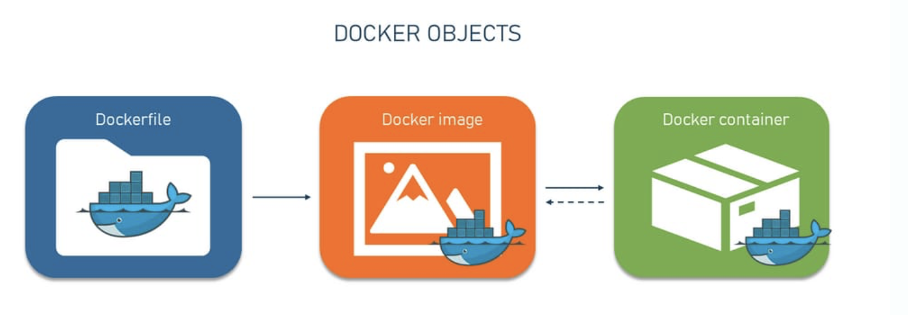

# Technical Report for Class Assignment 4 Part 1

- This technical report documents Class Assignment 4 part 1 about **Docker**, completed by Maria Parreira (Student ID: 1231843), a student at ISEP and Switch.

## Introduction

- Docker is a containerization platform that allows to package an application and its dependencies into a standardized unit called a container.
- Docker simplifies the process of building, shipping, and running applications by providing a consistent environment across different systems, regardless of the underlying infrastructure. 
- It achieves this through containerization, which encapsulates the application, its dependencies, and runtime environment into a single package. 
- This package, known as a Docker image, can be easily shared and deployed across various environments, from development laptops to production servers.
- **Advantages of Docker** : Portability, Isolation, Efficiency, Scalability, Consistency.



### **Prerequisites**

1. Before getting started, ensure you have [Docker](https://docs.docker.com/get-docker/) installed on your machine.

### **Goal:** create a Docker container to run a chat server application.

- From Dockerfile [here](version1/Dockerfile) or [here](version2/Dockerfile) run the following command on terminal to build docker image:

```bash
docker build -t chat-server-app:1.0 .
```
- A Dockerfile is a script with instructions for creating a Docker image.
- The image is like a blueprint, and the Dockerfile is the recipe to create it (containing everything your application needs to run:code, dependencies, configurations)

- Now, from chat-server-app:1.0 image, run the following command on terminal to build a container:

```bash
docker run -d --name chat-server -p 5901:5900 chat-server-app:1.0
```

- A container is a lightweight, isolated environment that runs applications consistently across different systems. 
- It uses a Docker image to provide all the necessary components needed to run an application, ensuring it works the same everywhere.

- Now, you can test the connection to the chat server using a chat client. Make sure the client is pointing to host's IP address on port 5901.

- Run the following command on terminal:

```gradle
./grandlew runClient
```

