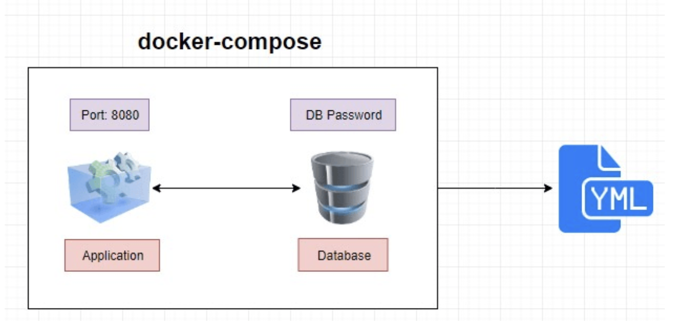
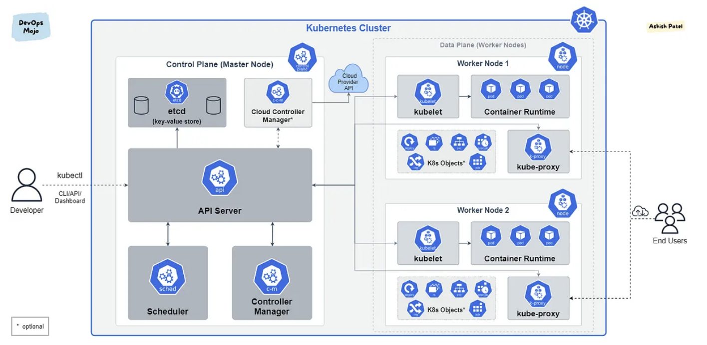

# Technical Report for Class Assignment 4 Part 2

- This technical report documents Class Assignment 4 part 2 about **Docker** and **Kubernetes**, completed by Maria Parreira (Student ID: 1231843), a student at ISEP and Switch.


## Introduction Docker Compose

- In this tutorial, will be used **Docker Compose** to create and manage two services: one is a SpringBoot application and another one is a H2 Database.

- Docker Compose allows to define and manage multi-container Docker applications using a single YAML file (docker-compose.yml). 
- Instead of manually starting and linking multiple containers, Docker Compose automates this process, making it easier to handle complex applications with several services.




### Prerequisites

1. [Docker](https://www.docker.com) installed on your machine.
2. [Docker Hub](https://hub.docker.com) account (if you want to publish the images).

### **Goal:** run and connect two different containers simultaneously using this [docker-compose.yaml](DockerCompose/docker-compose.yaml)

- This file defines both services (containers) and specifies how they should communicate with each other.
- To start both containers simultaneously, run the following command on terminal:

```bash
docker-compose up
```

## Introduction kubernetes

- In this tutorial, will be used **kubernetes** to create and manage two services: one is a SpringBoot application and another one is a H2 Database.
- Docker alone is great for running individual containers but lacks native tools for orchestrating and managing clusters of containers.
- Kubernetes automates the deployment, scaling, and management of containers across a cluster of machines, making it easier to manage large-scale applications.
- Kubernetes provides self-healing capabilities. It automatically restarts failed containers, replaces them, and reschedules Pods on healthy nodes if a node fails.
- Kubernetes has built-in service discovery and load balancing.
- You define the desired state of your application using YAML files. This includes the number of replicas (Pods), the container images to use, environment variables, and any other necessary configuration.



### Prerequisites

- [Minikube](https://minikube.sigs.k8s.io/docs/) installed on your machine with docker.

### **Goal:** run and connect multiple containers simultaneously using kubernetes .yaml files

- Run the following command to apply the [h2.yaml](Kubernetes/h2.yaml) configuration to your Kubernetes cluster:

```bash
kubectl apply -f h2.yaml
```

- This command will create the Deployment and Service defined in the database YAML file.

- Run the following command to apply the [webapp.yaml](Kubernetes/webapp.yaml) configuration to your Kubernetes cluster:

```bash
kubectl apply -f webapp.yaml
```

- This command will create the Deployment and Service defined in the web application YAML file.


- Check the status of the deployment to ensure the Pods are created and running:

```
kubectl get deployments
```

- Verify that the Pods are running correctly:

```
kubectl get pods
```

- Ensure the service is running and exposing the correct ports:

```
kubectl get services
```

## Key Concepts

### Pod

- The smallest and simplest Kubernetes object. A Pod can contain one or more containers that share the same network and storage.
- Containers within a Pod run on the same node and have access to the same IP address and storage volumes.
- Ideal for running a single service or task.
- 
### Deployment

- Deployment is a resource that manages the creation and updates of Pods. 
- It ensures a desired number of Pods are running at any time and facilitates updates and scaling.
- It uses an update strategy to replace old Pods with new ones, maintaining service availability.