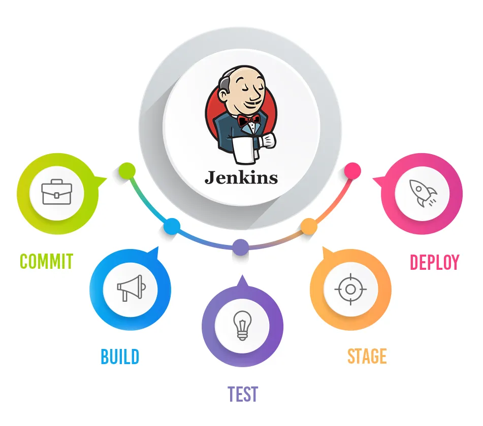

# Technical Report for Class Assignment 5

- This technical report documents Class Assignment 5 about **Jenkins**, completed by Maria Parreira (Student ID: 1231843), a student at ISEP and Switch.


## Introduction

- Jenkins is an open-source automation tool used to automate the software development process, particularly in continuous integration (CI) and continuous delivery (CD).

- Its significance lies in:
- 
    - Automating repetitive tasks such as building, testing, and deploying software.
    - Facilitating early detection of issues in code through continuous integration.
    - Speeding up the development cycle by automating the delivery of new releases.
    - Promoting consistency, standardization, and quality through automation.
    - Integrating with various tools and platforms, increasing flexibility.
    - Improving collaboration between development and operations teams (DevOps) by automating and monitoring the entire software lifecycle.




## Setup Jenkins container with Docker

- Open your terminal and run this command:

```bash
docker run -d \
  -u root \
  -v /var/run/docker.sock:/var/run/docker.sock \
  -v jenkins_home:/var/jenkins_home \
  -p 8080:8080 \
  -p 50000:50000 \
  jenkins/jenkins:lts
```


- Add Jenkins plugins. The plugins are:
  - Docker API Plugin
  - Docker Commons Plugin
  - Docker plugin
  - Docker pipeline
  - HTML Publisher plugin

- Create new global credentials in Jenkins to store the Docker Hub credentials:
  - Select "Username with password" as the kind of credentials
  - Enter the username and password for Docker Hub
  - Enter an ID for the credentials (e.g., docker-credentials)
  - Click "OK"
  - Go to Jenkins System section, at Declarative Pipeline (Docker) add docker credentials


## Jenkinsfile for SpringBoot Application

- Create a new item in jenkins with the following steps:

    - Click on "New Item"
    - Enter the item name (webapp-pipeline for the example)
    - Select "Pipeline" and click "OK"
    - In the "Pipeline" section, select "Pipeline script from SCM"
    - Choose Git as the SCM
    - In the "Repository URL" field, enter the URL of the repository
    - In the "Script Path" field, enter the path to the Jenkinsfile, specific to the repository
    - Click "Save"


### Step 3: Verify the Pipeline Functionality in Jenkins

- Commit the Jenkinsfile to the repository.
- Open docker desktop and login to docker hub.
- Run the pipeline by clicking on "Build Now".
- Check the results of the pipeline (if successful, the build should be green)
- Check the docker hub for the image created.
- Check the docker desktop for the container running.
- Access the application at http://localhost:8090/basic-0.0.1-SNAPSHOT

My RESULTS


