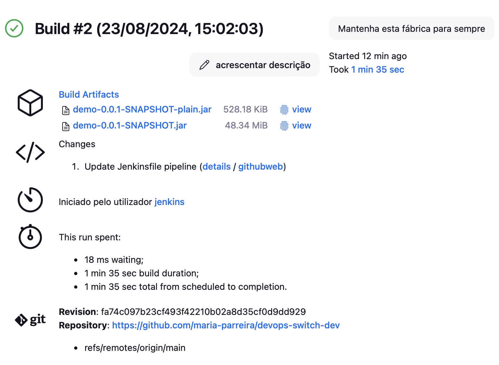
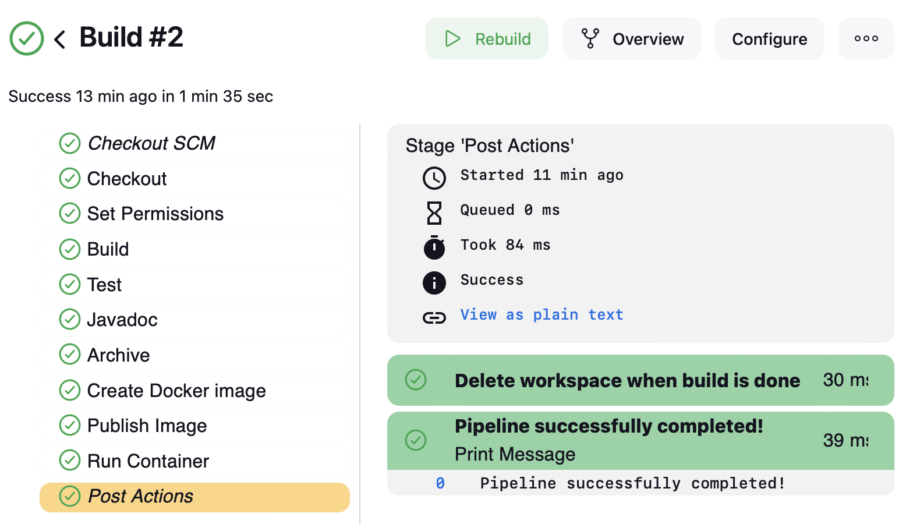

# Technical Report for Class Assignment 5


- This technical report documents Class Assignment 5 about **Jenkins**, completed by Maria Parreira (Student ID: 1231843), a student at ISEP and Switch.


## Introduction

- Jenkins is an open-source automation tool used to automate the software development process, particularly in continuous integration (CI) and continuous delivery (CD). 

- Jenkins is essential for modern development teams looking to automate and streamline their software development processes, enhancing efficiency, quality, and delivery speed.

- Its significance lies in:

    - Automating repetitive tasks such as building, testing, and deploying software.
    - Facilitating early detection of issues in code through continuous integration.
    - Speeding up the development cycle by automating the delivery of new releases.
    - Promoting consistency, standardization, and quality through automation.
    - Integrating with various tools and platforms, increasing flexibility.
    - Improving collaboration between development and operations teams (DevOps) by automating and monitoring the entire software lifecycle.


### The report is divided into sections:

1. **Set up Jenkins**
2. **Part 1: Gradle Basic Demo Application**
3. **Part 2: Spring Boot Application**
4. **Final Steps**


## Set up Jenkins

- **Install Jenkins using .war file [See instructions HERE](https://www.jenkins.io/doc/book/installing/war-file/)**

- Open your terminal/console and run the following command:

```bash
java -jar jenkins.war
```

- Wait for Jenkins to start. You can access it by navigating to http://localhost:9090 in your web browser. 
- Configure account and password.
- Install the suggested plugins.

- Add Jenkins plugins. The plugins are:
  - Docker API Plugin
  - Docker Commons Plugin
  - Docker plugin
  - Docker pipeline
  - HTML Publisher plugin

- Create an environment variable in Jenkins to store the Docker Hub credentials:
  - Select "Username with password" as the kind of credentials
  - Enter the username and password for Docker Hub
  - Enter an ID for the credentials (e.g., docker-credentials)
  - Click "OK"


## Part 1: Gradle Basic Demo Application

### Step 1: Create a Pipeline for the Gradle Basic Demo CA2.PART1

- Click on "New Item"
- Select "Pipeline" and give it a name, e.g., "Gradle Basic Demo".
- Select "Pipeline" and click "OK"
- In the job configuration, go to the "Pipeline" section.
- Set "Definition" to "Pipeline script from SCM".
- Set "SCM" to "Git" and provide the repository URL (e.g. https://github.com/mariaparreira-code/devops-23-24-JPE-1231843.git)
- In the "Script Path" field, enter the path to your Jenkinsfile, e.g., CA5/Jenkinsfile.


**Create the Jenkinsfile**

- In your repository, create a file named Jenkinsfile inside the CA5 directory with the following content:

```groovy
pipeline {
    agent any

    stages {
        stage('Checkout') {
            steps {
                git branch: 'main', url:'https://github.com/mariaparreira-code/devops-23-24-JPE-1231843.git'
            }
        }

        stage('Assemble') {
            steps {
                dir('CA2.Part1') {
                    sh './gradlew assemble'
                }
            }
        }

        stage('Test') {
            steps {
                dir('CA2.Part1') {
                    sh './gradlew test'
                }
            }
            post {
                always {
                    junit '**/build/test-results/**/*.xml'
                }
            }
        }

        stage('Archive') {
            steps {
                archiveArtifacts artifacts: '**/build/libs/*.jar', fingerprint: true
            }
        }
    }
}
```

### Step 2: Verify the Pipeline Functionality in Jenkins


- Save the configuration and click on "Build Now" to start the pipeline.
- Monitor the pipeline execution in the Jenkins interface. You will see logs for each stage (Checkout, Assemble, Test, Archive).
- After the execution, check the unit test results in the "Test Result" tab.
- Verify that the artifacts have been archived correctly in the "Artifacts" tab.


**My RESULTS**




## Part 2: Spring Boot Application

### Step 1: Create a Pipeline for the Spring Boot Application CA2.Part2

- Create a new item in jenkins with the following steps:

    - Click on "New Item"
    - Enter the item name (SpringBootApplication-CA2.Part2 for the example)
    - Select "Pipeline" and click "OK"
    - In the "Pipeline" section, select "Pipeline script from SCM"
    - Choose Git as the SCM
    - In the "Repository URL" field, enter the URL of the repository
    - In the "Script Path" field, enter the path to the Jenkinsfile2, specific to the repository
    - Click "Save"


## Step 2: Create the Jenkinsfile

In your repository, create a file named Jenkinsfile2 inside the CA5 directory with the following content:

```groovy
pipeline {
  agent any

  environment {
    DOCKER_CREDENTIALS_ID = 'docker-credentials'
    DOCKER_IMAGE = 'maria1231483/ca2-part2-jenkins'
    DOCKER_TAG = "${env.BUILD_ID}"
  }

  stages {
    stage('Checkout') {
      steps {
        echo 'Checking out code from the repository'
        git branch: 'main', url: 'https://github.com/mariaparreira-code/devops-23-24-JPE-1231843.git'
      }
    }

    stage('Set Permissions') {
      steps {
        dir('Ca2.Part2/demoWithGradle') {
          echo 'Setting executable permissions on gradlew...'
          sh 'chmod +x gradlew'
        }
      }
    }

    stage('Assemble') {
      steps {
        retry(3) {
          dir('CA2.Part2/demoWithGradle') {
            echo 'Assembling the application...'
            sh './gradlew assemble'
          }
        }
      }
    }

    stage('Test') {
      steps {
        dir('CA2.Part2/demoWithGradle') {
          echo 'Running unit tests...'
          sh './gradlew test'
        }
      }
    }

    stage('Javadoc') {
      steps {
        dir('Ca2.Part2/demoWithGradle') {
          echo 'Generating Javadoc...'
          sh './gradlew javadoc'
          publishHTML(target: [
                  allowMissing: false,
                  alwaysLinkToLastBuild: false,
                  keepAll: true,
                  reportDir: 'build/docs/javadoc',
                  reportFiles: 'index.html',
                  reportName: 'Javadoc'
          ])
        }
      }
    }

    stage('Archive') {
      steps {
        dir('Ca2.Part2/demoWithGradle') {
          echo 'Archiving artifacts...'
          archiveArtifacts artifacts: 'build/libs/*.jar', fingerprint: true
        }
      }
    }

    stage('Create Dockerfile') {
      steps {
        dir('Ca2.Part2/demoWithGradle') {
          script {
            def dockerfileContent = """
                        FROM gradle:jdk21
                        WORKDIR /app
                        COPY build/libs/demo-0.0.1-SNAPSHOT.jar app.jar
                        EXPOSE 8080
                        ENTRYPOINT ["java", "-jar", "app.jar"]
                        """
            writeFile file: 'Dockerfile', text: dockerfileContent
          }
        }
      }
    }

    stage('Verify Docker Context') {
      steps {
        script {
          echo 'Verifying Docker contexts...'
          sh 'docker context ls'
          sh 'docker context use default'
        }
      }
    }

    stage('Publish Image') {
      steps {
        script {
          docker.withRegistry('https://index.docker.io/v1/', "${DOCKER_CREDENTIALS_ID}") {
            dir('Ca2.Part2/demoWithGradle') {
              def customImage = docker.build("${DOCKER_IMAGE}:${DOCKER_TAG}")
              customImage.push()
              customImage.push('latest')
            }
          }
        }
      }
    }

    stage('Run Container') {
      steps {
        script {
          echo 'Running Docker container...'
          sh "docker run -d -p 8080:8080 ${DOCKER_IMAGE}:latest"
        }
      }
    }
  }
}

```

### Step 3: Verify the Pipeline Functionality in Jenkins

- Commit the Jenkinsfile2 to the repository.
- Open docker desktop and login to docker hub.
- Run the pipeline by clicking on "Build Now".
- Check the results of the pipeline (if successful, the build should be green)
- Check the docker hub for the image created.
- Check the docker desktop for the container running.
- Access the application at http://localhost:8080/basic-0.0.1-SNAPSHOT
- The machines can be verified at the Docker Hub at the following addresses: The image is now available at https://hub.docker.com/r/maria1231483/ca2-part2-jenkins/tags


My RESULTS



## Final Steps

- Push your changes to the repository.

- Tag your repository:

```bash
git tag -a ca5 -m "version ca5 release"
git push origin --tags
```
